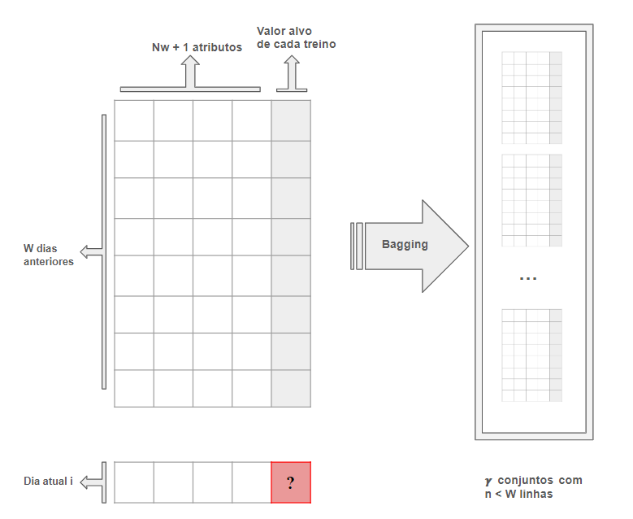
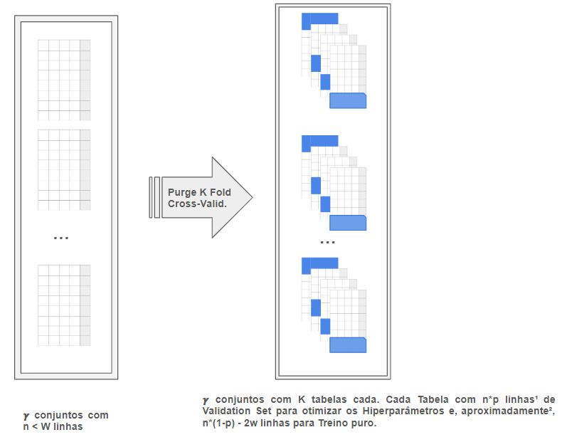
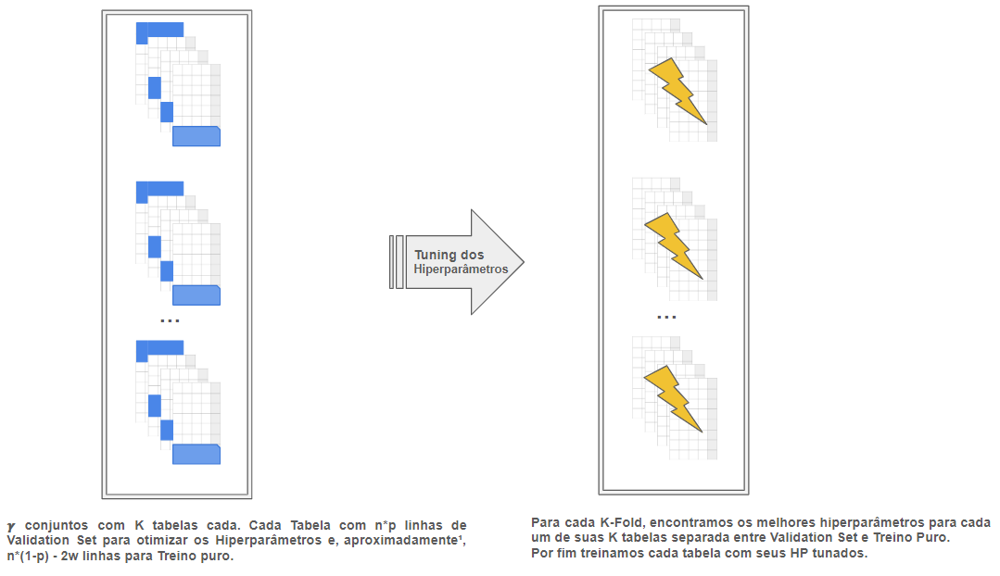
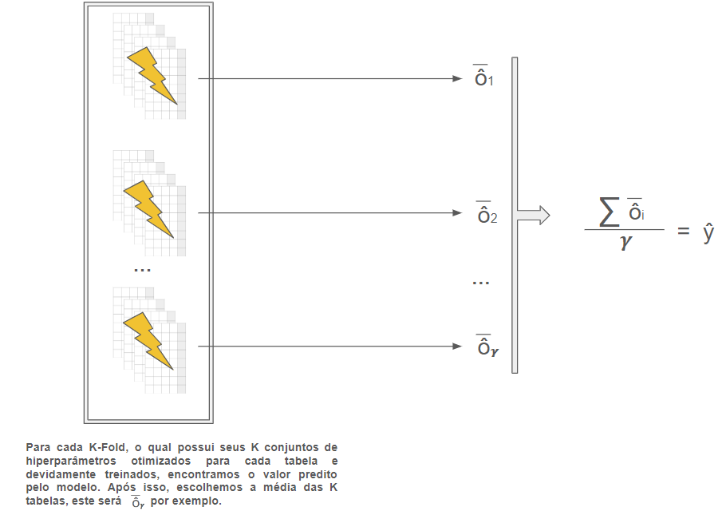

Projeto Quant.

*Autores: Bruno Franco, Jean Carlo Amaral, João Matheus Del Vecchio.*

# Referências

### **Papers**
* [The best of two worlds: Forecasting high frequency volatility for cryptocurrencies and traditional currencies with Support Vector Regression](https://github.com/JoaoDelVecchio/Quantamental/tree/main/Papers/Forecasting%20HFT%20volatility%20for%20crypto%20with%20SVM)
* [Intelligent forecasting with machine learning trading systems in chaotic intraday Bitcoin market](https://github.com/JoaoDelVecchio/Quantamental/tree/main/Papers/forecasting%20with%20machine%20learning%20trading%20in%20chaotic%20intraday%20Bitcoin)
* [Reinforcement Learning for Quantitative Trading](https://github.com/JoaoDelVecchio/Quantamental/tree/main/Papers/Reinforcement%20Learning%20for%20Quantitative%20Trading)
* [Applying Artificial Intelligence in Cryptocurrency Markets: A Survey](https://github.com/JoaoDelVecchio/Quantamental/tree/main/Papers/Applying%20Artificial%20Intelligence%20in%20Cryptocurrency%20Markets)
* [Anticipating Cryptocurrency Prices Using Machine Learning](https://github.com/JoaoDelVecchio/Quantamental/tree/main/Papers/Anticipating%20Cryptocurrency%20Prices%20Using%20Machine%20Learning)
* [Trading and Arbitrage in Cryptocurrency Markets](https://github.com/JoaoDelVecchio/Quantamental/tree/main/Papers/Trading%20and%20Arbitrage)
* [AUTOMATED CRYPTOCURRENCIES PRICES PREDICTION USING MACHINE LEARNING](https://github.com/JoaoDelVecchio/Quantamental/tree/main/Papers/AUTOMATED%20CRYPTOCURRENCIES%20PRICES%20PREDICTION%20USING%20ML)
* [Cryptocurrency Trading Using Machine Learning](https://github.com/JoaoDelVecchio/Quantamental/tree/main/Papers/Cryptocurrency%20Trading%20Using%20Machine%20Learning)
* [A deep Q-learning portfolio management framework for the cryptocurrency market](https://github.com/JoaoDelVecchio/Quantamental/tree/main/Papers/A%20deep%20Q-learning%20portfolio%20management%20framework)
* [EXTREME CORRELATION IN CRYPTOCURRENCY MARKETS](https://github.com/JoaoDelVecchio/Quantamental/tree/main/Papers/EXTREME%20CORRELATION%20IN%20CRYPTOCURRENCY%20MARKETS)
* [Market Sentiment and an Overnight Anomaly](https://github.com/JoaoDelVecchio/Quantamental/tree/main/Papers/Market%20Sentiment%20and%20an%20Overnight%20Anomaly)
* [Seasonality, Trend-following, and Mean reversion in Bitcoin](https://github.com/JoaoDelVecchio/Quantamental/tree/main/Papers/Seasonality%2C%20Trend-following%2C%20and%20Mean%20reversion%20in%20Bitcoin)
* [Cryptocurrency trading: a comprehensive survey](https://github.com/JoaoDelVecchio/Quantamental/tree/main/Papers/Cryptocurrency%20trading%20a%20comprehensive)

### **Livros**
* [Advances in Financial Machine Learning. LOPEZ DE PRADO, Marcos](https://github.com/JoaoDelVecchio/Quantamental/tree/main/Livros/Marcos%20Lopez%20%20Advances%20in%20Financial%20Machine%20Learning)
* [Artificial Intelligence in Finance A Python-Based Guide. Hilpisch, Yves.](https://github.com/JoaoDelVecchio/Quantamental/tree/main/Livros/artificial-intelligence-in-finance-a-python-based-guide)
* [Introduction to the Economics and Mathematics of Financial Markets. ZAPATERO, Fernando.](https://github.com/JoaoDelVecchio/Quantamental/tree/main/Livros/Caltech%20-%20Mathematical%20Models%20for%20Finance)
* [MACHINE LEARNING FOR ASSET MANAGERS. LOPEZ DE PRADO, Marcos](https://github.com/JoaoDelVecchio/Quantamental/tree/main/Livros/MACHINE%20LEARNING%20FOR%20ASSET%20MANAGERS)
* [Statistical Analysis of Financial Data. GENTLE, James.](https://github.com/JoaoDelVecchio/Quantamental/tree/main/Livros/statistical-analysis-of-financial-data)
* [Analysis of Financial Time Series. RUEY S. TSAY](https://github.com/JoaoDelVecchio/Quantamental/tree/main/Livros/analysis-of-financial-time-series)
* [THE ANALYSIS OF TIME SERIES AN INTRODUCTION. Chris Chatfield.](https://github.com/JoaoDelVecchio/Quantamental/tree/main/Livros/the-analysis-of-time-series-an-introduction-5-ed)

### Sites
* [Awesome Systematic Trading Repository](https://github.com/paperswithbacktest/awesome-systematic-trading.git)

# 1. Fundamentação e Estrutura

O projeto tem como objetivo criar uma estratégia quantitativa de investimento aplicada no mercado de criptomoedas, utilizando de Redes Neurais com arquiteturas LSTM para a predição do retorno de cada ativo e da teoria de portifólio de Markowitz para a construção de uma carteira otimizada.

## Tese

O mercado de Criptomoedas possui duas características singulares que o diferencia dos outros tipos de ativos financeiros: **alta** **volatilidade** dos preços e **alta** **correlação** entre as principais moedas. 

A primeira característica implica em uma dificuldade inerente em se utilizar de modelos estatísticos e econometricos bem estabelecidos, como estratégias de Média Móvel, Trend Following ou Reversão a Média para a predição do retorno de Criptomoedas, uma vez que esses modelos econometricos baseados em regressão são extremamente dependentes da linearidade dessas características, porém a alta volatilidade nos dá indícios de uma dependência não linear entre os dados passados e o alvo futuro. Desse modo, temos a hipótese de que, para o mercado de Criptomoedas, a utilização de modelos de Machine Learning mais complexos não é apenas interessante, mas **decisiva** e **fundamental** para uma estratégia quantitativa eficiente nesse setor.

A respeito da segunda, podemos elaborar a tese de que, para a predição mais efetiva do valor esperado de uma criptomoeda, devemos levar em consideração dados e informações das outras semelhantes para a modelagem do problema.

Além disso, podemos hipotetizar uma possível dependencia entre o preço das Criptomoedsa e fatores que influênciam a atividade de mineiração de Bitcoin, como preço de óleo e gás, ou custo de energia nos países chaves para a mineração, ou catástrofes climáticas de escopo global.

## Revisão da Literatura

A principal revisão de literatura é o aritigo ""Anticipating Cryptocurrency Prices Using Machine Learning" que utiliza de 3 modelos de Machine Learning para prever retorno de uma carteira de criptomoedas, sendo um desses modelos uma Rede Neural com Arquitetura LSTM. 

Nos dois modelos iniciais ele utiliza a ideia de se basear nos dados das outras moedas também para a modelagem do preço futura de uma única moedas espcífica. Entretanto, ele não aplica essa ideia no modelo de LSTM, no qual ele se limita a utilizar o retorno de uma certa moeda X nos ultimos T dias para prever o valor futura. Além disso, o paper é bastante vago quanto a forma como eles otimizam seus hiperparâmetros e não parece ter um método rigoro, moderno ou científico para realizar a Ciência de Dados (evitando overfitt, incoerências, etc). 

Portanto, observamos aí uma oportunidade de melhorar essa estratégia: adicionando novas features ao modelo, realizando um método científico mais rigoroso e moderno com base no livro "Advances in Financial Machine Learning. LOPEZ DE PRADO, Marcos" para a escolha de hiperparâmetros e fuga de overfit, e possívelmente realizando um sampleling mais complexo com Dollar Bars ou Unbalanced Dollars Bars.

## Etapas

O projeto como um todo seguirá as etapas abaixo.

- [ ] Coleta de Dados
- [ ] Análise Exploratória
- [ ] Tratamento dos Dados
- [ ] Código do Modelo
- [ ] Aplicação do Modelo
- [ ] Backtesting
- [ ] Análise dos Resultados
- [ ] Melhorias

## Cronograma

- [ ] Delegar responsável pelas seguintes áreas: Coleta de Dados e Código do Modelo; Além de delimitar uma data limite para essas tarefas

## Desafios e Problemas

Principal desafio é se isso realmente tem potencial de funcionar ou vai dar tudo errado kkkkk

Mas falando sério, as principais complicações que vejo no projeto são:

* A maior parte das criptomoedas são extremamente recentes, dificultando usar dados muito antigos
* A dimensionalidade do modelo pode estar muito grande devido a essa hipotese de adicionar os valores de todas as moedas como features.
* A complexidade de se criar um algoritmo de LSTM vai ser enorme. Principalmente porque é possível que algumas partes nós teremos que implementar na mão, uma vez que nosso método científico é meio específico a fim de evitar overfitt e trazer resultados mais robustos
* A volatilidade ainda me é uma dúvida, não sei se o ideal seria adicionar um modelo de previsão para ela ou o que. Para contornar esse problema sugiro começarmos primeiro do mais simples.

> **Mas e caso dê ruim?** - Esse relatorio está estrutural de tal modo que, para cada etapa são descritos possíveis modos de se fazer acontecer, do mais simples ao mais difícil. Nossa fuga caso algo de errado será sempre retornar para o método mais simples.
## Hasta la vista, Cripto

Como ideia de design e personalidade do nosso "Algoritimo", sugiro que o nome dele seja **LSTMinator**. Como referência ao querido e famoso Android dos cinemas "Terminator". Além de possuir a referência/metáfora de ser um exterminador do futuro assim como nosso projeto tem a ideia de se baser no passado pra prever o futuro e todo esse blá blá blá e baboseira que parece divertido para a banca.

# 2. Dados

## Panorama Geral e Contextualização

A parte de coleta de dados consiste em coletarmos os dados (quem diria né) necessários para a aplicação do modelo. Os dados que precisamos coletar são diretamente dependentes dos atributos que iremos considerar para a função objetivo.

Desse modo, nesse capítulo será dito quais são as tabelas que a equipe de dados terá que criar e tratar para serem usadas pela equipe de código.

## Estruturas de Atributos

Como possibilidades de atributos a se considerar no modelo, temos 4 estruturas, que aqui estão enunciadas da ordem de menos complexa para mais complexa.

### Estrutura 1 - Simples

  * $w$ últimos Retornos Logaritmos da moeda a ser analisada.
  
Ou seja, nessa estrutura estamos supondo que o valor esperado do nosso Retorno Logarítmo para certo dia de uma certa moeda $m_k$ será uma função dos $w$ últimos Retornos Logaritmos dessa moeda $m$

$$
R^i_{m_k} = f(R^{i-1}_{m_k}, R^{i-2}_{m_k}, ..., R^{i-w}_{m_k}) + \epsilon
$$

Numero total de atributos =  $w$

### Estrutura 2 - Simples com cerejinha

  * $w$ últimos Retornos Logaritmos da moeda a ser analisada.
  * $w$ últimos valores de volume da moeda a ser analisada.
  * $w$ últimos valores em dólares de transações da moeda a ser analisada.
  * idade da moeda
  
Ou seja, nessa estrutura estamos supondo que o valor esperado do nosso Retorno Logarítmo para certo dia de uma certa moeda $m_k$ será uma função dos $w$ últimos Retornos Logaritmos dessa moeda $m$

$$
R^i_{m_k} = f(R^{i-1}_{m_k},..., R^{i-w}_{m_k}, V^{i-1}_{m_k}, ..., V^{i-w}_{m_k},  D^{i-1}_{m_k}, ..., D^{i-w}_{m_k}, I^{i-1}_{m_k}) + \epsilon
$$

Total de Features =  $3 w + 1$

### Estrutura 3 - Simples criativa

* $w$ últimos Retornos Logaritmos de todo um conjunto de N moedas a serem analisadas.
* Idade da moeda

$$
R^i_{m_k} = f(R^{i-1}_{m_1}, ..., R^{i-w}_{m_1}, ..., R^{i-1}_{m_k}, ..., R^{i-w}_{m_k}, ..., R^{i-1}_{m_N}, ..., R^{i-w}_{m_N}, I^{i-1}_{m_k}) + \epsilon
$$

Total de Features =  $Nw + 1$

### Estrutura 4 - Simples criativa e com cerejinha

* $w$ últimos Retornos Logaritmos de todo um conjunto de N moedas a serem analisadas.
* $w$ últimos valores de volume da moeda a ser analisada.
* $w$ últimos valores em dólares de transações da moeda a ser analisada.
* Idade da moeda

$$
R^i_{m_k} = f(R^{i-1}_{m_1}, ..., R^{i-w}_{m_1}, ..., R^{i-1}_{m_k}, ..., R^{i-w}_{m_k}, ..., R^{i-1}_{m_N}, ..., R^{i-w}_{m_N}, \\
V^{i-1}_{m_k}, ..., V^{i-w}_{m_k},  D^{i-1}_{m_k}, ..., D^{i-w}_{m_k}, I^{i-1}_{m_k}) + \epsilon
$$

Total de Features =  $(N+2)w + 1$

### Estrutura 4 -  Alternativa

  * Média dos $w$ últimos Retornos Logaritmos de todo um conjunto de N moedas a serem analisadas.
  * Desvio padrão dos $w$ últimos Retornos Logaritmos de todo um conjunto de N moedas a serem analisadas.
  * Média dos $w$ últimos valores de volume de todo um conjunto de N moedas a serem analisadas.
  * Desvio padrão dos $w$ últimos valores de volume de todo um conjunto de N moedas a serem analisadas.
  * Média dos $w$ últimos valores em dólares de transações de todo um conjunto de N moedas a serem analisadas.
  * Desvio Padrão dos $w$ últimos valores em dólares de transações de todo um conjunto de N moedas a serem analisadas.
  * Média do Market Share dessa moeda dos ultimos $w$ dias
  * Desvio Padrão do Market Share dessa moeda dos ultimos $w$ dias
  * Trend do Market Share dessa moeda dos ultimos $w$ dias
  * Idade da moeda

 
$$
R^i_{m_k} = f(\mu^{R}_{m_1}, \sigma^{R}_{m_1}, ..., \mu^{R}_{m_N},\sigma^{R}_{m_N}, ..., \mu^{V}_{m_1}, \sigma^{V}_{m_1},..., \mu^{V}_{m_N}, \sigma^{V}_{m_N},\\  \mu^{D}_{m_1}, \sigma^{D}_{m_1},..., \mu^{D}_{m_N}, \sigma^{D}_{m_N},\\
 \mu_{ms}, \sigma_{ms}, \Delta_{ms}, I^{i-1}_{m_k} ) + \epsilon
$$

Total de Features =  $6N + 4$

### Estrutura 5 - All In1

* $w$ últimos Retornos Logaritmos de todo um conjunto de N moedas a serem analisadas.
* $w$ últimos valores de volume de todo um conjunto de N moedas a serem analisadas.
* $w$ últimos valores em dólares de transações de todo um conjunto de N moedas a serem analisadas.
* Idade da moeda
* Média do Market Share dessa moeda dos ultimos $w$ dias
* Desvio Padrão do Market Share dessa moeda dos ultimos $w$ dias
* Trend do Market Share dessa moeda dos ultimos $w$ dias

$$

R^i_{m_k} = f(R^{i-1}_{m_1}, ..., R^{i-w}_{m_1}, ..., R^{i-1}_{m_N}, ..., R^{i-w}_{m_N},
V^{i-1}_{m_1}, ..., V^{i-w}_{m_1},..., V^{i-1}_{m_N}, ..., V^{i-w}_{m_N},\\
D^{i-1}_{m_1}, ..., D^{i-w}_{m_1}, ..., D^{i-1}_{m_N}, ..., D^{i-w}_{m_N}, I^{i-1}_{m_k}, \mu_{ms}, \sigma_{ms}, \Delta_{ms} ) + \epsilon

$$

Total de Features =  $3Nw + 4$

1    <small>Ainda existiria uma outra possível adição de complexidade e, a qual envolveria atributos climáticos, preço de petróleo, preço de energia renovável, entre outros.</small>

## Estrutura escolhida

Recomendo primeiro pensarmos em trabalhar com a **Estrutura 3** - *Simples criativa* e, caso dê tudo certo, migramos para uma estrutura mais complexa futuramente

Entretanto, a criação das tabelas será independente da estrutura escolhida, com a motivação de evitar a necessidade de futura surubação para atualizar as tabelas com os dados necessários. Para isso, na proxima parte idei descrever o "banco de dados" que deveremos ter, contando com todas as features possíveis (se escolhermos uma estrutura mais simples basta não utilizar tudo).

## Maldição da Dimensionalidade

Esse acredito eu que vai ser o maior problema do projeto. No artigo que estamos usando como base, a todo momento que ele fazia um modelo de ML com dimensionalidade muito alta alguma coisa estava errado. No próprio modelo mesmo dele foi utilzado só os valores de Retorno daquela moeda como features.

Como uma proposta de solução, sugiro que a gente estude técnicas como redução de dimensionalidade em problemas de aprendizado de máquina, como por exemplo a técnica LASSO. Vou ser bem honesto aqui, eu não faço bulhufas de ideia de como isso funciona, se e que fuciona, mas pode ser uma boa forma de tentar lidar com esse problema.

## Etapas

- [ ] Coleta do "Banco Dados"
- [ ] Análise Exploratória
- [ ] Tratamento

## Banco de Dados

* Precisamos de uma tabela para cada uma das N moedas escolhidas
* Cada uma dessas tabelas deve conter linhas que representem um certo dia da criptomoeda em específico.
* Cada uma dessas linhas deve conter as seguintes colunas, nessa ordem:
    * $Nw$ colunas contendo os preços de cada um dos últimos $w$ dias de todas as N moedas que iremos considerar.
    * $Nw$ colunas contendo o retorno logaritmo e cada um dos ultimos $w$ dias de todas as N moedas que iremos considerar.
    * $Nw$ colunas contendo os volumes de cada um dos últimos $w$ dias de todas as N moedas que iremos considerar.
    * $Nw$ colunas contendo os valores transacionados em Dolar de cada um dos últimos $w$ dias de todas as N moedas que iremos considerar.
    * Uma coluna contendo a média do market share da criptomoeda dos últimos $w$ dias.
    * Uma coluna contendo o desvio padrão do market share da criptomoeda dos últimos $w$ dias.
    * Uma coluna contendo s trend (final menos inicial) do market share da criptomoeda dos últimos $w$ dias.
    * Uma coluna contendo a idade atual em dias da criptomoeda em questão
    * Como ultima coluna, sendo essa nossa coluna **alvo**: O valor do Retorno Logaritmo daquele dia em específico.

A escolha de N vai ser com base no que a equipe de dados achar mais importante.

## Análise Exploratória

Nessa seção a equipe de Dados vai atualizando com o que foi feito.

Mas em geral, a ideia da nossa Análise Exploratória é gerar algumas observações que corroborem com a nossa tese, como a alta correlação entre os retornos dos ativos, etc.

Por fim, essa é uma etapa que vai da liberdade criativa da equipe em gerar insights.

## Tratamento

* Garantir que os dados estejam normalizados
* Lidar com dados nulos ou não existentes
* Lidar com possíveis Outliers

## Desafios

* Falta de dados de grande parte das moedas
* Alta dimensionalidade das estruturas propostas
* Dificuldade de se conseguir os dados em questão

## Aperfeiçoamento

Aqui é o famoso: *se tudo ficar pronto rápido, temos um super trunfo final*

### Sample Bars

Tudo que vou escrever aqui é baseado no livro do Lopez de Prado.

* Nem sempre é interessante utilizar dias como bars (conjunto de informação)
* Em vez disso, uma alternativa é agrupar nosso conjunto de informação com base em uma quantidade de dolares tradados específico
* Desse modo, a cada $10^5$ Dólares, por exemplo, criariamos uma sample com seus atributos próprios: Preço, Retorno, Idade, etc.
* Isso serve para que cada sample represente mais possivelmente uma quantidade de informação existente no mercado. Duas samples diferentes nos "garante" que ocorreu nova informação
* A desvantagem é que teremos potencialmente menos "samples" no total, além de dificultar bastante a criação do banco de dados

# 3. Método Científico

## Panorama Geral e Contextualização

Um dos defeitos do artigo que usamos como base é o fraco método científico dele. Os hiperparâmtros foram gerados a moda caralha, desse modo os resultados foram jogados pro leitor, gerando pouca confiança.

É estritamente necessário termos uma processo bem estabelecido que reduza o overfit do nosso modelo, e o torne o mais verdadeiro possível, de tal forma que vamos poder confiar no resultado encontrado.

Mas o que eu quero dizer com método científico? Eu quero dizer sobre as etapas de ciencia de dados que vamos fazer para: Tunar Hiperparâmetros, Treinar o modelo e fazer o backtesting;

## Principais Modelos

Os possíveis modelos saem desse fluxo de decisão:

Modelo mais simples: Modelo 4 e Modelo 1
Modelo mais complexo: Modelo 3

## Modelo Escolhido

Embora tenha todo aquele papinho de se escolher o modelo mais simples inicialmente, o *Modelo 3* é o que almejamos. Logo pode ser que inicialmente a gente construa um código para o modelo 1 ou 4 e então adaptemos para o modelo 3.

Entretando, vale explicar o que está acontecendo de fato nesse modelo

### Etapas do Modelo 3

* Vamos supor que estamos no dia i, e queremos prever o valor do retorno desse dia i.
* Primeiro, vamos selecionar os últimos W dias anteriores a i.
* Cada um desses W dias anteriores a i possui seus atributos próprio de acordo com a estrutura definida na etapa de Dados. Além do valor alvo que é o retorno logaritmo do dia.
* Então temos que trabalhar com uma tabela de W linhas e C colunas.
* Dessa tabela inicial, vamos criar $\gamma$ novos conjuntos de dados, cada um com um número de linhas $n < W$ linhas. Esses conjuntos serão criados por meio de Bagging, que é uma palavra chique para a tecnica de: selecionar aleatoriamente n linhas do meu dataset original e criar um novo e então fazer isso repetidamente, com reposição, até termos $\gamma$ novas tabelas.
  
  > Talvez isso acarrete em algumas incoerência na hora de fazer o Purge Cross-Validation, mas iremos tentar contornar isso posteriormente.

* Agora vamos para a etapa de Purge K-Fold Cross Validation
* Em suma, para cada tabela criada pelo bagging vamos criar K novas tabelas idênticas.
* Entretanto, para cada uma destas novas tabelas, 10% delas será destinado como Validation Set, enquanto os outros 90% será o Training Set.
* O Validation Set de todas as K tabelas deverá ser diferente (caso o seenhorito tenha rapidamente notado, isso implica em K = 10).
* O ideal é que a primeira tabela terá os primeiros 10% elementos como validation set, a segunda tabela terá os segundo 10% e assim por diante

>   Validation Set é o conjunto no qual vamos "testar" o modelo treinado pelo training set para cada um dos hiperparâmetros diferentes, para então escolhermos o melhor conjunto desses hiperp. possível.

* Mas aqui vem o pulo do gato. Não podemos ter sobreposição, isso é, existe situações que o training set, por conter atributos dos ultimos 8 dias, irá conter os valores do validation set, o que geraria incongruência e overfitt.
* Para isso, sempre que cirar uma dessas novas tabelas, garanta que não haverá sobreposição.

  

* Depois dessa etapa, com todas as tabelas construidas e delimitadas, vamos tunar os hipermarâmetros de cada tabela k de cada conjunto de $\gamma$. Desse modo, cada Fold terá K conjuntos de hiperparâmetros ótimos para o par Validation/Training Set específico.

* Por fim, treinamos cada tabela do Fold por meio do algoritmo do LSTM com seu conjunto de Hiperparâmetros ideal.
* Para cada Fold então, calculamos o resultado do modelo para o nosso querido retorno no dia i. O resultado da previsão de cada Fold será a média dos resultados deste.
* Depois, pegamos o resultado $\overline{\hat o_t}$ de cada um dos grupos de $\gamma$ e fazemos a média deles
* Essa média será a predição final de nossá máquina  $\hat y$

## Desafios

* Montar cada uma das funções vai ser desafiador
* Talvez Bagging seguido de CV não seja o ideal - E se fizermos o contrário?

# 4. Código

## Panorama Geral e Contextualização

Vamos utilizar uma arquitetura de rede neural chamada LSTM, que é basicamente uma rede neural com capacidade de memória a longo prazo, extremamente útil para modelos de séries temporal

## Benchmark

Nosso Benchmark será tanto algum índice que ainda precisamos escolher quanto um modelo de econometria já bem estabelecido: Simple Moving Average SMA.

O modelo de SMA está implementado e descrito a seguir:

Essa estratégia baseia-se na *hipótese* de que o **retorno do ativo segue uma distribuição aproximadamente constante ao longo do tempo.** Portanto, o valor esperado dessa distribuição pode ser estimado pela média dos retornos passados.

$$
E[R_t] = \frac{1}{N}\sum_{i= t-N}^{t-1} R_i = \overline{R}
$$

Analogamente, a variância do retorno (que representa o risco) é dada por:

$$
\sigma_t^2 = \frac{1}{N-1}\sum_{i= t-N}^{t-1} (R_i - \overline{R})^2
$$

$$
Cov(R_x, R_y) = \frac{1}{N-1} \sum_{i=t-N}^{t-1} (R^y_i - m_y)(R^x_i - m_x)
$$

Importante lembrar que esse retorno é o logarítmico, embora ele seja muito próximo do retorno percentual para valores pequenos.

- **Retorno Percentual**: $r_{t} = \frac{X_t - X_{t-1}}{X_{t-1}}$
- **Retorno Logarítmico**: $R_t = \ln(r_t + 1)$

Onde $X_t$ representa o valor do ativo no instante $t$

Desse modo, temos o seguinte roteiro: Para determinada moeda, em determinado instante t, realizamos a média dos últimos N instantes. O valor esperado será igual a essa média.
Além disso, calculamos a variância amostral desses q ultimos instantes, este será o valor esperado do risco.

> Peceba que surge um hiperparâmetro - Qual a quantidade de instantes N que eu devo contabilizar na média?

Embora uma quantidade maior eu esteja pegando teoricamente encontrando um valor mais preciso da média da distribuição temos que lembrar que a distribuição pode mudar, logo valores menores fazem com que consideremos apenas a teorica *distribuição mais recente*.

Além disso, um pouco mais discreto, temoso hiperparâmetro que representa o intevalo de tempo que pretendemos realizar o trading. Chamaremos ele de $x_{days}$

> Qual o intervalo de tempo $x_{days}$ entre nossas operações?

Para valores altos de $x_{days}$ estamos provavelmente trabalhando com volatilidades menores. Entretanto, quanto maior o valor de $x_{days}$, menor será a nossa possibilidade de treinamento e backtesting pois menor será a nossa quantidade de dados disponíveis.

A Aplicação desta estratégia foi feita [aqui](https://github.com/JoaoDelVecchio/Quantamental/tree/main/Etapa%201/Estrat%C3%A9gia%2001)

Realizei uma otimização força bruta para encontrar os melhores valores dos hiperparâmetros acima. Como métrica eu considerei a tupla de $(N,x_{days})$ que acarretasse em menor média de Erro Quadrático Médio (MSE) nas 20 moedas selecionadas, em todo o período de existência de cada uma.

> Moedas selecionadas: *Bitcoin, Ethereum, XRP (Ripple), Litecoin, Bitcoin Cash, Cardano, Polkadot, Chainlink, Dogecoin, Polygon, Uniswap, Solana, TRON, Stellar Lumens, Avalanche, Shiba Inu, Filecoin, Algorand, VeChain, Tezos, EOS.*

Resultado da Otimização de parâmetros - 

**Tabela 1: 10 Valores de  $(N,x_{days})$ com menores MSE entre as principais 20 criptomoedas**
| Média MSE  | 0.014484 | 0.014487 | 0.014487 | 0.014487 | 0.014488 | 0.014489 | 0.014490 | 0.014491 | 0.014494 | 0.014494 |
|------------|----------|----------|----------|----------|----------|----------|----------|----------|----------|----------|
| N          | 62       | 59       | 69       | 60       | 61       | 70       | 64       | 58       | 63       | 71       |
| x_days     | 1        | 1        | 1        | 1        | 1        | 1        | 1        | 1        | 1        | 1        |

Percebe-se que para essa etratégia, o período mais eficaz de trading foi de 1 dia para cada operação. Além disso, considerar em torno de 1 mês para realizar a média dos retornos mostrou-se mais eficaz.

O Objetivo da etapa 2 consiste, com base nos valores esperados calculados pela etapa 1, alocar um determinado percentual de um capital C em um conjunto de n possíveis ativos financeiros de risco de modo a maximizar  a relação Retorno_ajustado/Risco.

A estratégia 2.1 consiste em aplicar um algoritmo genético para encontrar a melhor alocação perncentual de capital num conjunto de criptomoedas determinado
Para a aplicação desta estratégia, precisamos de: valor esperado do retorno do ativo e matriz de covariânvia entre os ativos.

A estratégia está sendo implementada [aqui](https://github.com/JoaoDelVecchio/Quantamental/tree/main/Etapa%202/Estrat%C3%A9gia%202.1).

Essa estratégia a alocação de portfolio financeiro é baseada na Teoria de Portfólio  Markowitz (Mean-Variance Portfolio Theory)  e assim tem como base o cálculo de retornos e covariâncias destes retornos. 

Lembrando:
- **Retorno Percentual**: $r_{t} = \frac{X_t - X_{t-1}}{X_{t-1}}$
- **Retorno Logarítmico**: $R_t = \ln(r_t + 1)$
- **Valor Esperado do Retorno Percentual:=** $m$
- **Valor Esperado do Retorno Logartimico:=** $\mu$
- **Risco Percentual:=** $s^2$
- **Risco Logartimico:=** $\sigma^2$

Relação entre ambos: $m = e^{\mu} - 1$ ,     $s^2 = e^{2\mu}(e^{\sigma^2} - 1)$

* Por motivos práticos, para a etapa de otimização de portfólio vamos utilizar os valores percentuais.
* Além disso, vamos considerar inicialmente o valor esperado do retorno anual de cada ativo (Podemos alterar isso depois)

> Essa alteração deve ser feita em conjunto com a otimização de parâmetros da *Etapa 1*. Observe que inicialmente consideramos $x_{days} = 252$ e $N = maximo$.

Assim, para encontrarmos o valor esperado de cada ativo:

$$
E[R_{t}] = \mu_t = 252 (\frac{1}{N} \sum_{i = t-N}^{t-1}{R_i}) = 252 \overline{R}
$$

$$
m_t = e^{\mu_t} - 1 = e^{252 \overline{R}} - 1 
$$

$$
m_t = e^{\frac{252}{N} \sum{R_i}} - 1 
$$

$$
m_t = e^{\frac{252}{N} \sum{ln(1 + r_i)}} - 1
$$

$$
m_t = e^{\sum{ln(1 + r_i)^{\frac{252}{N}}}} - 1 = \prod{(1+r_i)^{\frac{252}{N}}} - 1
$$

$$
m_t = \prod_{i = t-N}^{t-1}{(1+r_i)^{\frac{252}{N}}} - 1
$$

Dessa forma, será este o valor esperado para uma certo criptomoeada que iremos utilizar na implementação.

Além disso, a Matriz de Covariância Cov é fácil de se calcular:

$$
Cov(r_x, r_y) = \frac{1}{N-1} \sum_{i=t-N}^{t-1} (r^y_i - m_y)(r^x_i - m_x)
$$
> Questionamento: Porque é assim?

> Note que estamos a todo momento dependendo desse hiperparâmetro N, assim como na etapa 1

Vamos considerar o vetor x como sendo o vetor contendo os pesos de cada ação no portifólio (porcentagem do capital total investido nesta).
Tome que a quantidade de criptos utilizada no portifólio é 20.

$$
X = [w_1,w_2,...,w_i,..., w_{20}]^T
$$

O vetor m contem o retorno médio percentual anual esperado de cada cripto

$$
M = [m_1,..m_i,...,m_{20}]^T
$$

Temos que o valor esperado do retorno percentual do portifólio será:

$$
E[r_P] = E[\sum_{i=1}^{20}{w_i r_i}] = \sum_{i=1}^{20}{w_i m_i} = \langle X, M \rangle
$$

Além disso, o risco desse nosso portifólio é:

$$
s_P = \sqrt{\sum{w_i^2 s_i^2}  +\sum{\sum_{i \neq j}{2 w_i w_j Cov_{i,j}}}} = \sqrt{X^T * Cov * X}
$$

# BackTest
